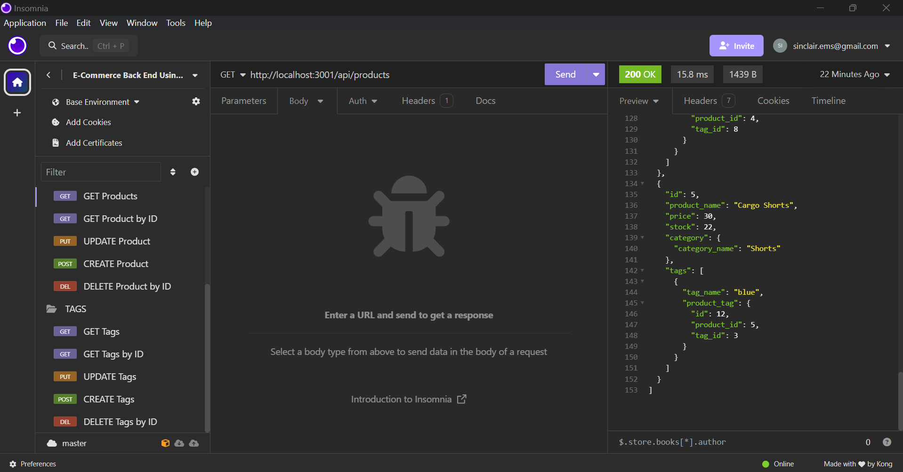
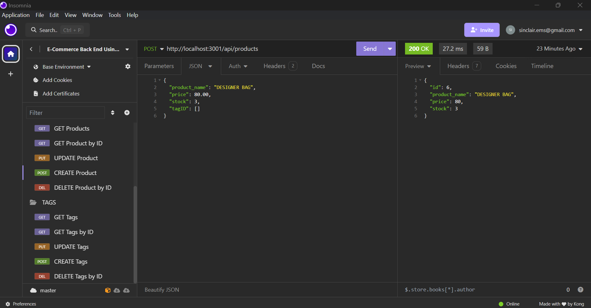
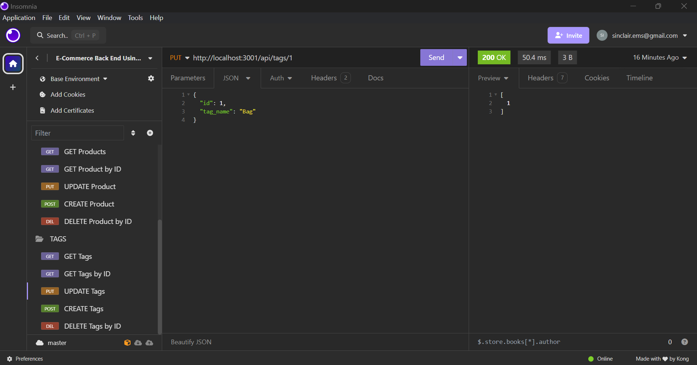

# 13 Object-Relational Mapping (ORM): E-Commerce Back End
A command-line program using multiple APIs to allow users to apply the CRUD method to Products, Categories, and Tags in an E-Commerce setting. 

## WalkThrough Video Link

Check out the 
[Link to Walkthrough Video](https://drive.google.com/file/d/1c5C8x3kK2v_xim-Fw-pmlwCqqfoDIda-/view)

You might notice:
THERE IS A BUG IN UPDATING THE PRODUCT
THERE IS A BUG IN CREATING THE TAGS 

I will look for solutions to these at a later time. 

Here's what it looks like in Insomnia:

  ## Technologies Used

  dotenv 8.2.0
  
  Express 4.17.1

  MySQL 2.1.0

  Sequelize 6.37.1

  ## Credits

 * Class notes

* [Product Routes help](https://github.com/jpd61/e-commerce-backend/blob/master/routes/api/product-routes.js#L124)

* Copilot

## License

This project is licensed under the MIT license.